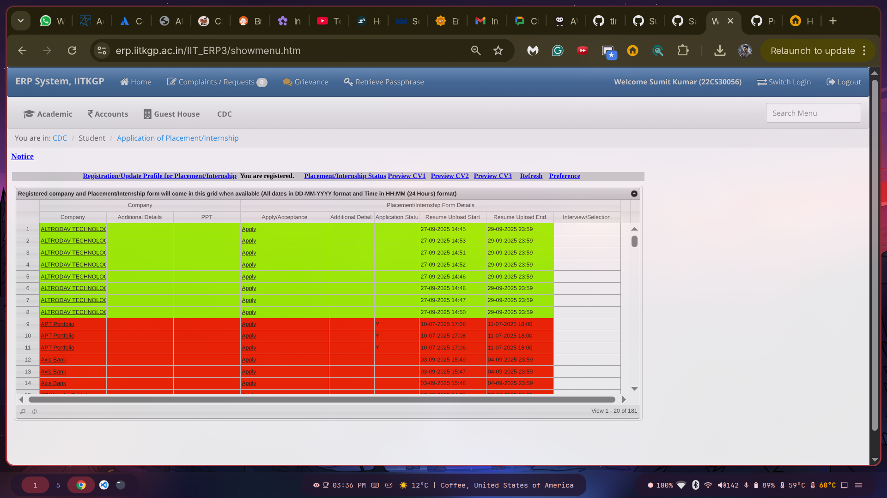

# ERP CV Deadline Highlighter

A Chrome extension that highlights CV deadlines in ERP systems with color-coded visual indicators for better deadline management.

## Author
**Sumit Kumar**

## Contact
For questions, issues, or contributions, please reach out via:
- GitHub Issues (preferred for bug reports and feature requests)
- Email: sumitkanpur2005@gmail.com

## Installation (Chrome)

1. Download the extension and unzip it.  
2. Open [chrome://extensions/](chrome://extensions/).  
3. Toggle **Developer mode** (top-right corner).  
4. Click **Load unpacked** → select the folder `erp-cv-deadline-highlighter` (the one containing all the source files).

As soon as I get some funding to for the Chrome Web Store Account I will publish it there for easy downloading. Till then :)

## Documentation

For detailed information about this project, please refer to the following documentation:

- **[Installation Guide](docs/INSTALLATION.md)** 
- **[Development Guide](docs/DEVELOPMENT.md)**  
- **[Funding Information](docs/FUNDING.md)** 

## Quick Start

1. Clone or download this repository
2. Follow the [Installation Guide](docs/INSTALLATION.md) for setup instructions
3. Load the extension in Chrome developer mode
4. Navigate to your ERP system and start highlighting deadlines!

⭐ **Star this repository if you find it helpful!**
