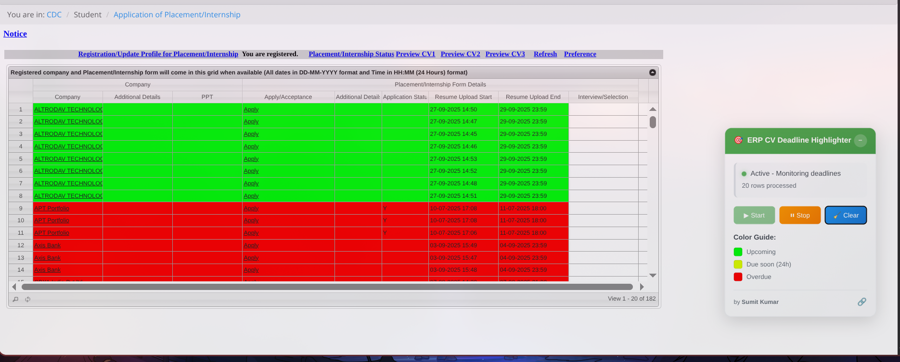

# ERP CV Deadline Highlighter

A Chrome extension that highlights CV deadlines in ERP systems with color-coded visual indicators for better deadline management.

## Author
**Sumit Kumar**

## Contact
For questions, issues, or contributions, please reach out via:
- GitHub Issues (preferred for bug reports and feature requests)
- Email: sumitkanpur2005@gmail.com

## Installation (Chrome)
1. Click *Download extension* and unzip.
2. Open chrome://extensions/.
3. Enable *Developer mode*.
4. Click *Load unpacked* → select the folder with manifest.json.

If you prefer a one-click install for many users, consider publishing to the Chrome Web Store.

## Documentation

For detailed information about this project, please refer to the following documentation:

- **[Installation Guide](docs/INSTALLATION.md)** 
- **[Development Guide](docs/DEVELOPMENT.md)**  
- **[Funding Information](docs/FUNDING.md)** 

## Quick Start

1. Clone or download this repository
2. Follow the [Installation Guide](docs/INSTALLATION.md) for setup instructions
3. Load the extension in Chrome developer mode
4. Navigate to your ERP system and start highlighting deadlines!

⭐ **Star this repository if you find it helpful!**
